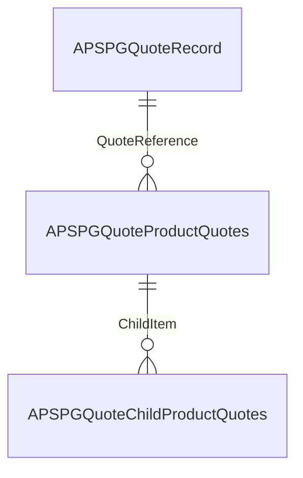

# APSPG Quote

## 前端项目名: Quote_Vite

### 前端库

- npm create vite@latest
- npm install react-router-dom@6 -S
- npm install @reduxjs/toolkit react-redux
- npm install @mui/material @emotion/react @emotion/styled
- npm install @mui/icons-material @mui/material @emotion/styled @emotion/react
- npm install @mui/x-date-pickers@^8.0.0
- npm install dayjs
- npm install @mui/x-charts

## 后端项目名: Quote_Api

### 后端库

- Python（FastApi）

## 数据库

### 数据表关系



- 登录验证符合OAuth2.0，数据库存入Hash值，token有效时间为1小时，referToken有效时间为1天，将刷新token存入
[RefreshToken] NVARCHAR(500) NULL,
[RefreshTokenExpiry] DATETIME2 NULL,

### 关系说明

- 第一层关系
  - APSPGQuoteRecord → APSPGQuoteProductQuotes
    - 关联字段：
      - QuoteReference
    - 关系类型：
      - 1 : N
    - 说明：
      - 一个询价项目可以包含多个产品项。

### 第二层关系

- APSPGQuoteProductQuotes → APSPGQuoteChildProductQuotes
  - 关联字段：
    - ChildItem
  - 关系类型：
    - 1 : N
  - 说明：
    - 一个产品项可以包含多个附件、选配件或子产品。

## 前端搜索页面(Quote Search)

可以按照产品需求文档（PRD）的形式来描述，这样后面你开发 ASP.NET Core + Vue/WPF 时也比较清晰。

### APSPG Quote 查询功能需求说明

#### 一、功能目标

提供统一的报价查询页面，支持根据项目及产品信息进行快速检索。

查询结果来源于：

* APSPGQuoteRecord（项目主表）
* APSPGQuoteProductQuotes（产品项表）

并支持展开查看：

* APSPGQuoteChildProductQuotes（产品子项表）

---

#### 二、查询条件

1. FS Number

查询字段：

```text
APSPGQuoteProductQuotes.FSNumber
```

查询方式：

多关键字模糊搜索

分隔符：

```text
*
```

示例：

```text
FS100*
FS200*
FS300
```

系统自动拆分为：

```sql
FSNumber LIKE '%FS100%'
OR FSNumber LIKE '%FS200%'
OR FSNumber LIKE '%FS300%'
```

说明：

支持同时查询多个 FS Number。

---

2.Rating

查询字段：

```text
APSPGQuoteProductQuotes.Rating
```

查询方式：

单条件模糊查询

示例：

```text
150
```

对应：

```sql
Rating LIKE '%150%'
```

---

3.Size

查询字段：

```text
APSPGQuoteProductQuotes.Size
```

查询方式：

单条件模糊查询

示例：

```text
4
```

对应：

```sql
Size LIKE '%4%'
```

---

4.Body Material

查询字段：

```text
APSPGQuoteProductQuotes.BodyMaterial
```

查询方式：

单条件模糊查询

示例：

```text
WCB
```

对应：

```sql
BodyMaterial LIKE '%WCB%'
```

---

5.End Connection

查询字段：

```text
APSPGQuoteProductQuotes.EndConnection
```

查询方式：

单条件模糊查询

示例：

```text
RF
```

对应：

```sql
EndConnection LIKE '%RF%'
```

---

6.Quote Reference

查询字段：

```text
APSPGQuoteRecord.QuoteReference
```

查询方式：

单条件模糊查询

示例：

```text
QT250001
```

对应：

```sql
QuoteReference LIKE '%QT250001%'
```

如果用户什么都不输直接点“查询”，加载前 20 条最新数据

#### 三、查询逻辑

查询主表：

```text
APSPGQuoteRecord
```

关联表：

```text
APSPGQuoteProductQuotes
```

关联字段：

```text
QuoteReference
```

关系：

```text
APSPGQuoteRecord
        1
        │
        │ QuoteReference
        ▼
APSPGQuoteProductQuotes
        N
```

查询结果返回：

* 项目信息
* 产品项信息

---

#### 四、结果列表

- 默认显示字段

| 字段                       | 来源表                  |
| -------------------------- | ----------------------- |
| Category                   | APSPGQuoteRecord        |
| ProductType                | APSPGQuoteProductQuotes |
| TypeDesign                 | APSPGQuoteProductQuotes |
| Rating                     | APSPGQuoteProductQuotes |
| RaisteamDesignCode         | APSPGQuoteProductQuotes |
| EndConnection              | APSPGQuoteProductQuotes |
| Size                       | APSPGQuoteProductQuotes |
| BodyMaterial               | APSPGQuoteProductQuotes |
| EngineeringID              | APSPGQuoteProductQuotes |
| FSNumber                   | APSPGQuoteProductQuotes |
| QuoteReference             | APSPGQuoteProductQuotes |
| TotalPriceNetUnit          | APSPGQuoteProductQuotes |
| OptionNetPriceExtraPerUnit | APSPGQuoteProductQuotes |
| QuoteTransferPerUnit       | APSPGQuoteProductQuotes |
| TransferPriceExtra         | APSPGQuoteProductQuotes |
| QuotePriceListPerUnit      | APSPGQuoteProductQuotes |
| ListPriceExtra             | APSPGQuoteProductQuotes |
| BuyerCustomer              | APSPGQuoteRecord        |
| EndUser                    | APSPGQuoteRecord        |
| LBPName                    | APSPGQuoteRecord        |
| EngineeringCharges         | APSPGQuoteProductQuotes |
| SourcingLocation           | APSPGQuoteRecord        |
| ReplyDate                  | APSPGQuoteProductQuotes |
| HandleById                 | APSPGQuoteRecord        |
| UserName                   | APSPGQuoteRecord        |
| SalesName                  | APSPGQuoteUser          |
| PatternCharges             | APSPGQuoteProductQuotes |

APSPGQuoteRecord.HandleById==APSPGQuoteUser.Id

---

#### 五、排序功能

列表所有列支持排序

#### 六、子项展开功能

- 查询结果支持展开查看产品子项。

关联关系：

```text
APSPGQuoteProductQuotes
        │
        │ ChildItem
        ▼
APSPGQuoteChildProductQuotes
```

关系类型：

```text
1 : N
```

- 子项显示字段

| 字段                       | 来源表                       |
| -------------------------- | ---------------------------- |
| ChildItem                  | APSPGQuoteChildProductQuotes |
| FSNumber                   | APSPGQuoteChildProductQuotes |
| TotalPriceNetUnit          | APSPGQuoteChildProductQuotes |
| OptionNetPriceExtraPerUnit | APSPGQuoteChildProductQuotes |
| QuoteTransferPerUnit       | APSPGQuoteChildProductQuotes |
| TransferPriceExtra         | APSPGQuoteChildProductQuotes |
| QuotePriceListPerUnit      | APSPGQuoteChildProductQuotes |
| ListPriceExtra             | APSPGQuoteChildProductQuotes |
| EngineeringHours           | APSPGQuoteChildProductQuotes |
| EngineeringCharges         | APSPGQuoteChildProductQuotes |

---

#### 七、分页

支持分页查询。

默认：

```text
20 Rows / Page
```

可选：

```text
20
50
100
200
```

#### 十、数据关系图

```text
APSPGQuoteRecord
        │
        │ QuoteReference
        ▼
APSPGQuoteProductQuotes
        │
        │ ChildItem
        ▼
APSPGQuoteChildProductQuotes
```

查询页面以 APSPGQuoteProductQuotes 为主体数据源，通过 QuoteReference 获取项目信息，通过 ChildItem 获取产品子项信息，实现项目 → 产品 → 子项三级结构展示。

## 每个人的看板

- 使用下拉菜单选择切换，并结合图表

## 图表

- 能够筛选ProductType
- Record总走势视图，月度视图，年度视图
  - - 月度/年度视图的统计依据是主表的创建日期
- 每个人的APSPGQuoteProductQuotes看板，User连接APSPGQuoteUser，包括各个子表格（走势图统计的是报价单的数量为主）

## 导出功能

```text
APSPGQuoteRecord
        │
        │ QuoteReference
        ▼
APSPGQuoteProductQuotes
        │
        │ ChildItem
        ▼
APSPGQuoteChildProductQuotes
```

- 连接其他所有需要的子表，Manager可以导出所有人数据，每个人可以导出自己的所有信息
- 导出格式为嵌套行格式，导出类型为.csv
